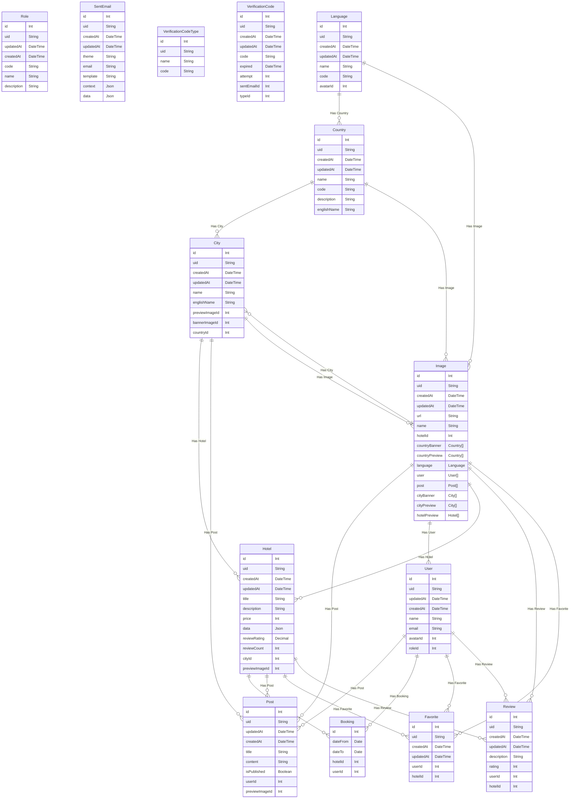

Схема базы данных
 

```mermaid
erDiagram
    Country {
id Int
uid String
createdAt DateTime
updatedAt DateTime
name String
code String
description String
englishName String
}

Hotel {
id Int
uid String
createdAt DateTime
updatedAt DateTime
title String
description String
price Int
data Json
reviewRating Decimal
reviewCount Int
cityId Int
previewImageId Int
}

Booking {
id Int
dateFrom Date
dateTo Date
hotelId Int
userId Int
}

Post {
id Int
uid String
updatedAt DateTime
createdAt DateTime
title String
content String
isPublished Boolean
userId Int
previewImageId Int
}

User {
id Int
uid String
updatedAt DateTime
createdAt DateTime
name String
email String
avatarId Int
roleId Int
}

Role {
id Int
uid String
updatedAt DateTime
createdAt DateTime
code String
name String
description String
}

SentEmail {
id Int
uid String
createdAt DateTime
updatedAt DateTime
theme String
email String
template String
context Json
data Json
}

VerificationCodeType {
id Int
uid String
name String
code String
}

VerificationCode {
id Int
uid String
createdAt DateTime
updatedAt DateTime
code String
expired DateTime
attempt Int
sentEmailId Int
typeId Int
}

Language {
id Int
uid String
createdAt DateTime
updatedAt DateTime
name String
code String
avatarId Int
}

City {
id Int
uid String
createdAt DateTime
updatedAt DateTime
name String
englishName String
previewImageId Int
bannerImageId Int
countryId Int
}

Image {
id Int
uid String
createdAt DateTime
updatedAt DateTime
url String
name String
hotelId Int
countryBanner Country[]
countryPreview Country[]
language Language
user User[]
post Post[]
cityBanner City[]
cityPreview City[]
hotelPreview Hotel[]
}

Favorite {
id Int
uid String
createdAt DateTime
updatedAt DateTime
userId Int
hotelId Int
}

Review {
id Int
uid String
createdAt DateTime
updatedAt DateTime
description String
rating Int
userId Int
hotelId Int
}

User 1--0+ Post : "Has Post"
User 1--0+ Booking : "Has Booking"
Hotel 1--0+ Booking : "Has Booking"
Hotel 1--0+ Post : "Has Post"
City 1--0+ Hotel : "Has Hotel"
Country 1--0+ City : "Has City"
Image 1--0+ Post : "Has Post"
Image 1--0+ User : "Has User"
Image 1--0+ Hotel : "Has Hotel"
Image 1--0+ City : "Has City"
Image 1--0+ Review : "Has Review"
Image 1--0+ Favorite : "Has Favorite"
Hotel 1--0+ Favorite : "Has Favorite"
User 1--0+ Favorite : "Has Favorite"
Hotel 1--0+ Review : "Has Review"
User 1--0+ Review : "Has Review"
City 1--0+ Post : "Has Post"
City 1--0+ Image : "Has Image"
Country 1--0+ Image : "Has Image"
Language 1--0+ Country : "Has Country"
Language 1--0+ Image : "Has Image"

```

