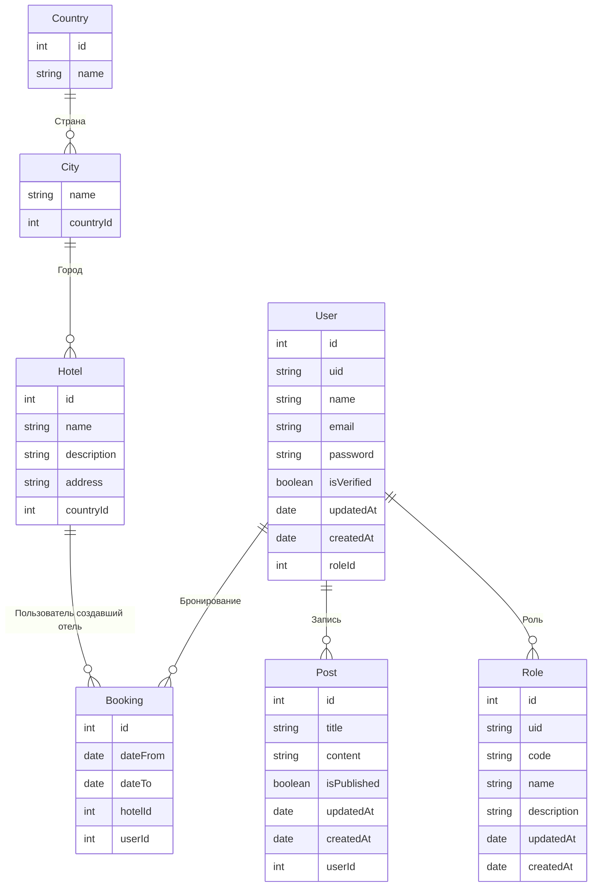

Схема базы данных
 

```mermaid
erDiagram
    Country {
        int id
        string name
    }

    Hotel {
        int id
        string name
        string description
        string address
        int countryId
    }
    Booking {
        int id
        date dateFrom
        date dateTo
        int hotelId
        int userId
    }
    Post {
        int id
        string title
        string content
        boolean isPublished
        date updatedAt
        date createdAt
        int userId
    }
    User {
        int id
        string uid
        string name
        string email
        string password
        boolean isVerified
        date updatedAt
        date createdAt
        int roleId
    }

    Role {
        int id
        string uid
        string code
        string name
        string description
        date updatedAt
        date createdAt
    }
    City {
        string name
        int countryId
    }
    User 1--0+ Role : "Роль"
    User 1--0+ Post : "Запись"
    User 1--0+ Booking : "Бронирование"
    Hotel 1--0+ Booking : "Пользователь создавший отель"
    City 1--0+ Hotel : "Город"
    Country 1--0+ City : "Страна"
    
```

